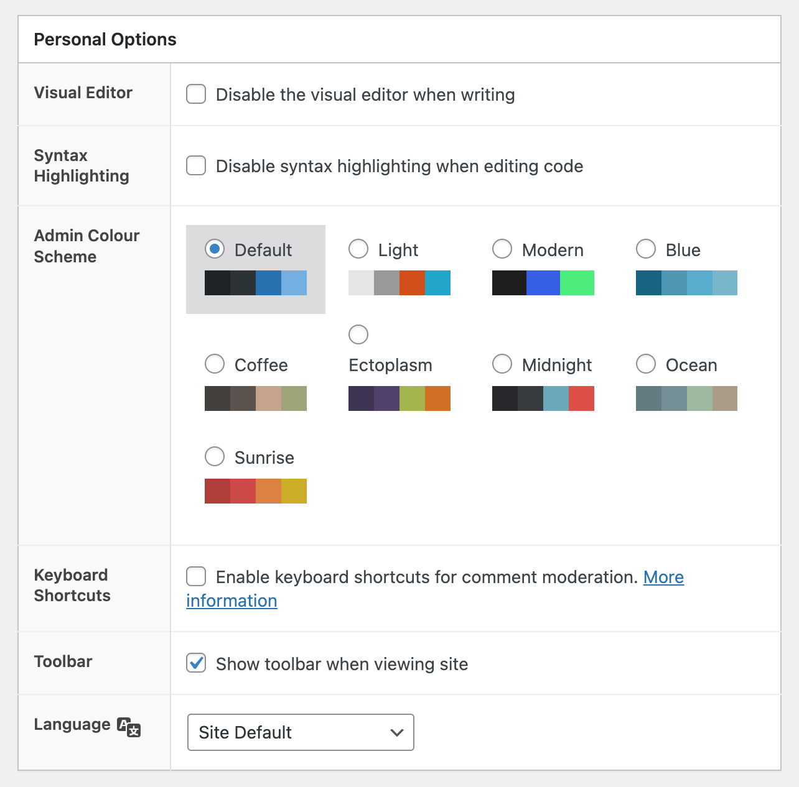

# Context WP User Options Hider

Tested up to: 5.9.1  
Tags: users, user, wordpress  
Contributors: robertandrews  

## Description

✂️ Removes 'Personal Options' settings box from WordPress' Edit User (profile edit) forms.

Personal Options box contains the following user options:

* Visual Editor
* Syntax Highlighting
* Admin Colour Scheme
* Keyboard Shortcuts
* Toolbar
* Language
* Site Default

## Acknowledgements

This plugin basically implements code offered in [this StackExchange thread](https://wordpress.stackexchange.com/questions/49643/remove-personal-options-section-from-profile/229014#229014), by respondents including @jason-vasilev. I am not the originator.

## Notes

This plugin stores no database information directly.
